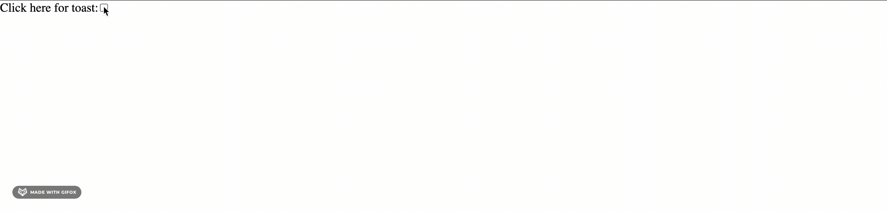

# toast-message
This project implements a toast notification and is inspired by [TaTa.js](https://www.cssscript.com/demo/toast-prompt-tata/). Here's the finished product:

Each toast message is on a timer and removes itself from the DOM when that timer expires:

In a future project, I'd like to implement an interface for creating toast messages with custom configuration. The user would be able to provide options via an object argument, allowing them to specify length of timer, type of notification, message text, toast color, etc.
